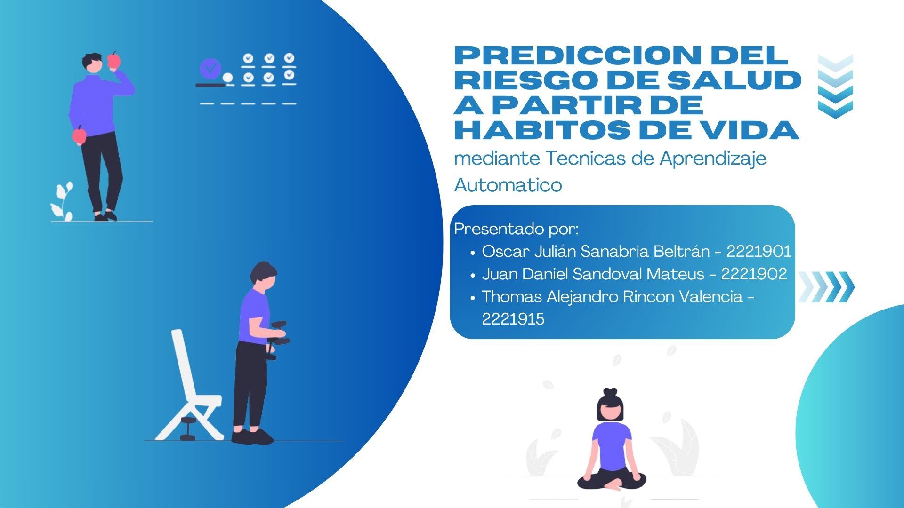

# Prediccion del riesgo de salud a partir de habitos de vida

## Objetivo:
Predecir del riesgo de salud a partir de habitos de vida mediante tecnicas de aprendizaje  automatico

## Informacion del dataset:
El dataset fue tomado de: https://www.kaggle.com/datasets/miadul/lifestyle-and-health-risk-prediction?resource=download

Este dataset sobre salud simula datos reales de estilo de vida y bienestar de individuos.

## Modelos Supervisados

  * GaussianNB
  * Decision Tree
  * Random Forest

## Modelos No Supervisados
Reducción de dimensionalidad:
 * PCA

Modelos de clustering
 * K-Means
 * DBSCAN

## integrantes
 * Oscar Sanabria
 * Thomas Rincon
 * Daniel Sandoval
 

## Enlaces
 * Video de YouTube: https://youtu.be/4dto2dpB4iQ?si=ARXOkN8EoQ042z4V
 * Slides: https://canva.link/t92wr53tbi0i3mj
 * Notebook: https://colab.research.google.com/drive/1mTwYpk20eJFyGR7cb5ycHtMcleoIRT9V?usp=sharing
